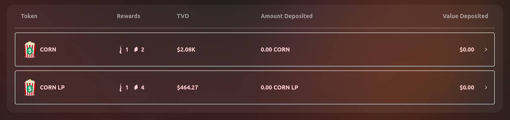

# Deposit in the Silo

Assets on the **Deposit Whitelist** can be Deposited in **the Silo** to earn Stalk and Seeds. You can find more information about Depositing in the Silo **here**.

1. Make sure you are on [topcorn.tezro.com](https://topcorn.tezro.com/) and [connect your wallet](../getting-started/connect-to-topcorn.md).
2. Navigate to the [“Silo” page](https://topcorn.tezro.com/silo). At the bottom of the page, there is a table showing the various assets on the Deposit Whitelist.
3.  Select the asset you want to Deposit.\

    <figure><figcaption></figcaption></figure>
4. In the “Deposit” tab, there is a drop down menu to select the token you would like to Deposit.
   *   For example, a Corn Deposit can be made in either Corn or BNB. BNB will be converted to Corn during the Deposit transaction.\

       <figure><figcaption></figcaption></figure>
5. Enter the amount you want to Deposit. A transaction preview showing the **Stalk and Seeds** to be rewarded will appear below the inputs. Select the “Transaction Details” dropdown to review each step of the transaction.
6.  You may select a slippage tolerance by selecting the gear icon. The default slippage tolerance is 0.1%.\

    <figure><figcaption></figcaption></figure>
7.  If you are Depositing BNB or have previously approved the asset being spent, skip to Step 10. For all other assets, select “Enable \[Token]”. This allows the Topcorn contract to spend the asset, but does not Deposit it yet.\

    <figure><figcaption></figcaption></figure>
8. Confirm the approval transaction in your wallet, and your hardware wallet, if applicable. You should verify that the transaction is interacting with the **correct contract** before signing it.
9.  Select “Deposit”.\

    <figure><figcaption></figcaption></figure>
10. Confirm the transaction in your wallet and your hardware wallet, if applicable. You should verify that the transaction is interacting with the **correct contract** before signing it.
11. After the transaction has been confirmed by the network, your Deposit will appear in the “Deposits” table at the bottom of the current page.
